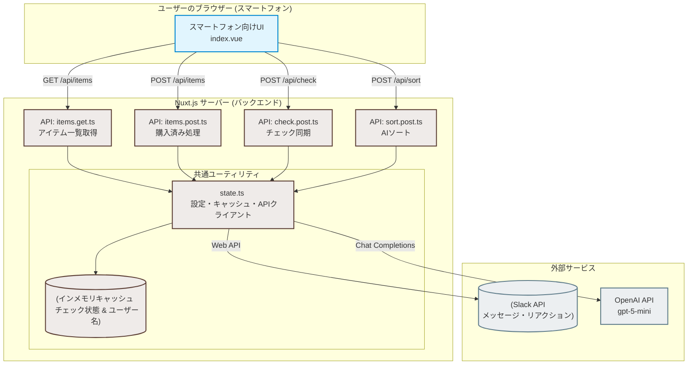

# Slack連動買い物リスト アプリケーション

Slackの指定したチャンネルの投稿を「1投稿＝1アイテム」とみなして連動する、スマートフォン向けの買い物リストWebアプリケーションです。

## 主な機能

- **Slack双方向連携**:
  - 表示時にSlackチャンネル内のメッセージ履歴（`:heavy_check_mark:` リアクションがついていないもの）を取得して一覧表示（デフォルトは投稿日時の昇順）。
  - アプリ上でチェックしたアイテムをまとめて「購入済み」にすると、Slackの該当メッセージに自動で `:heavy_check_mark:` リアクションを付与し、リストから非表示化。
- **マルチユーザー同期**:
  - 複数ユーザーが同時に触っている場合でも、自動ポーリングによって他のユーザーのチェック状態を即座に同期。
- **AI陳列順ソート**:
  - OpenAI API（設定されたチャットモデルや思考モデル）を活用し、アイテムを「一般的なスーパーマーケットの入店からレジへの導線」に基づいた陳列カテゴリ（野菜・果物、精肉、鮮魚など）に自動で分類・グループ化して表示。
- **スマートフォン特化 & ミニマルデザイン**:
  - 片手で操作しやすい大ぶりのタッチターゲットと、白・黒・グレーを基調としたミニマルで洗練されたモノトーンデザイン。

---

## システムアーキテクチャー

本アプリケーションは Nuxt 3 を用いたフルスタック構成になっており、Slack API と OpenAI API を連携させて動作します。



### 各コンポーネントの役割

- **フロントエンド (Browser)**:
  - スマートフォン操作に特化したモノトーンUI (`index.vue`)。
  - バックエンドAPIと通信し、アイテム表示・追加・購入済みチェック・AIソートを行います。
  - 定期ポーリングによる他ユーザーとのリアルタイムチェック状態同期を行います。
- **バックエンド (Nuxt Server API)**:
  - クライアントからの要求を受け取り、ビジネスロジックを実行または外部サービスを呼び出します。
  - 状態管理やキャッシュなどの内部状態を `state.ts` が制御します。
- **インメモリキャッシュ (Cache)**:
  - `checkedItems`: 複数ユーザー間でのリアルタイムなチェック状態同期のため、一時的にチェック状態をメモリ保持します。
  - `userNameCache` / `botNameCache`: Slack API のレート制限を回避するため、ユーザー名とボット名をキャッシュします。
- **外部サービス (Slack & OpenAI)**:
  - Slack: 買い物アイテムのデータストア（チャンネルの投稿をアイテム、チェックマークのリアクションで購入済みとみなす）。
  - OpenAI: 商品名をスーパーマーケットの陳列棚順カテゴリーに自動分類します。

---

## 事前準備

### 1. Slackアプリの作成と設定

1. [Slack API Control Panel](https://api.slack.com/apps) から新しいアプリを作成します。
2. **OAuth & Permissions** メニューに移動し、**Bot Token Scopes** に以下の権限を追加します。
   - `channels:history` （パブリックチャンネルの場合。プライベートチャンネルなら `groups:history` も必要）
   - `reactions:write` （購入済みアイテムにチェックマークリアクションを付与するため）
   - `users:read` （投稿ユーザーの表示名を取得するため）
3. **Install to Workspace** をクリックし、ワークスペースにアプリをインストールします。表示された **Bot User OAuth Token** (`xoxb-...`) を控えておきます。
4. 対象とするSlackチャンネルに、作成したアプリをインポート（`/invite @アプリ名` コマンド等）します。
5. チャンネルのURLや設定から **チャンネルID** (`C...`) を取得し、控えておきます。

### 2. OpenAI APIキーの取得

1. OpenAIのアカウントから APIキー (`sk-...`) を取得し、控えておきます。

---

## 環境変数の設定

アプリケーションの動作に必要なSlack APIの接続設定やOpenAI APIキーなどは、環境変数として指定します。
プロジェクトルート直下にある `.env.example` ファイルを参考に `.env` ファイルを作成し、必要な環境変数を定義してください。

> [!WARNING]
> `.env` にはAPIキーなどの機微情報が含まれるため、絶対に公開リポジトリにコミットしないでください（`.gitignore` に登録されています）。

---

## 起動手順 (Docker)

本プロジェクトはパッケージ管理ツールの実行やサーバーの起動をすべてコンテナ内で完結できるように設計されています。

### 開発環境の起動（ホットリロード対応）

初回起動時や `package.json` に変更があった場合は、手動で依存パッケージのインストールを行う必要があります。

```bash
docker compose run --rm app npm install
```

依存パッケージのインストール後、以下のコマンドを実行すると開発環境のコンテナが起動し、開発用サーバーが立ち上がります。

```bash
docker compose up app
```

- 開発用アクセスURL: [http://localhost:3000](http://localhost:3000) (または `compose.yaml` でマッピングしたホスト側のポート)
- ホスト側のソースコード変更は即座にコンテナ内に反映され、ホットリロード（HMR）が動作します。

### 本番環境の起動確認

本番環境向けのマルチステージビルドをシミュレートし、ビルドされたSSRサーバーを起動します。

```bash
docker build -t shopping-list-production --target production .
# ポート番号はホスト環境に合わせて適宜マッピングしてください（例: ホストの3000番にマッピングする場合）
docker run -d -p 3000:3000 --env-file .env --name shopping-list-production shopping-list-production
```

- 本番動作用アクセスURL: [http://localhost:3000](http://localhost:3000) (または起動時にマッピングしたポートのURL)

### パッケージの追加やコンテナ内でのコマンド実行

依存関係の追加など、シェルコマンドを実行する際は必ずコンテナ内で行ってください。

```bash
# 例：パッケージのインストール
docker compose run --rm app npm install <package_name>
```
